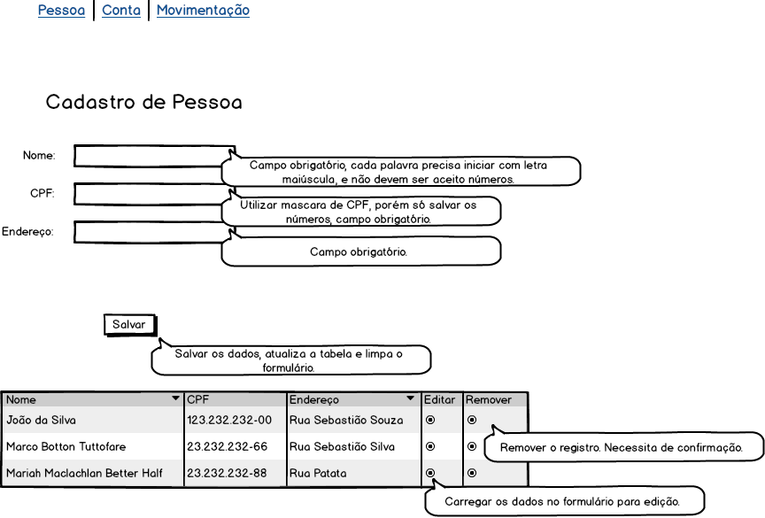

Este projeto consiste em desenvolver um sistema, conforme especificado nos protótipos abaixo.

**Cadastro de pessoa**

**Cadastro de conta**

**Cadastro de movimentação**

## Configuração do Projeto

Dump da estrutura do banco de dados esta em /docs

## Requerimentos

- PHP >= 5.6

- MySQL

- Composer

